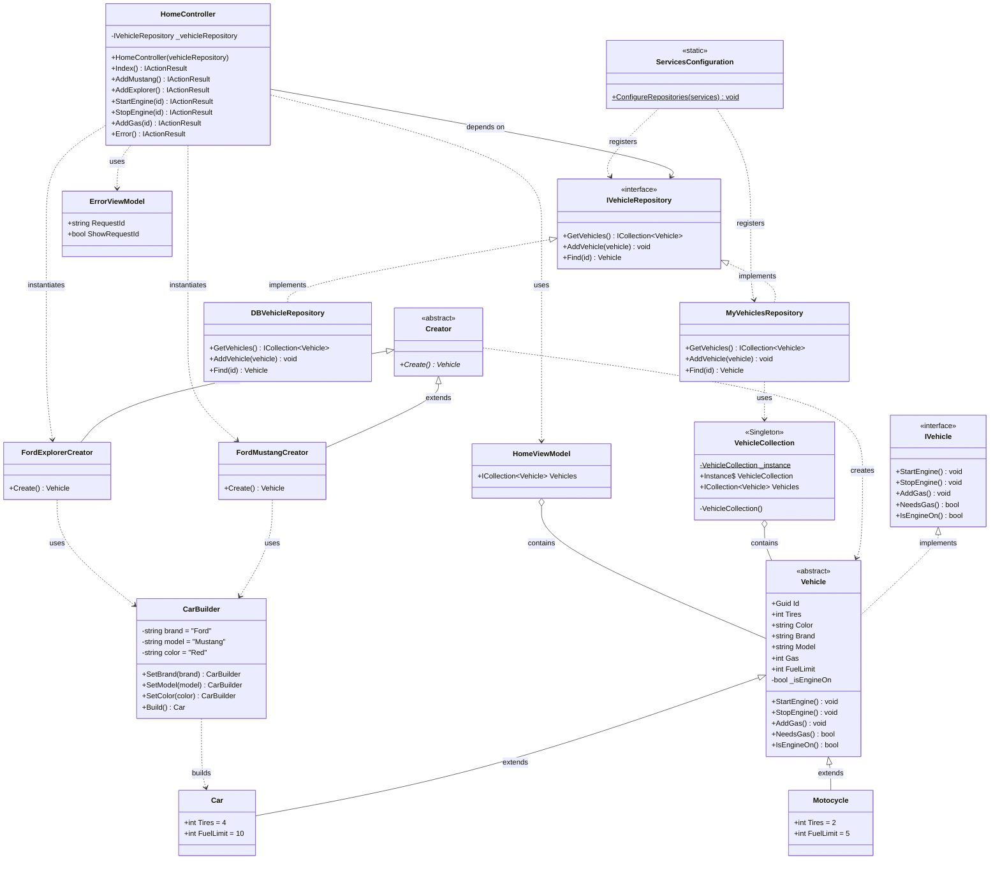

# UML Class Diagram - Best Practices Workshop

## Diagram (Mermaid)



## Design Patterns Visualization

### 1. Factory Method Pattern
```
Creator (Abstract)
    ├── FordMustangCreator → creates Car via CarBuilder
    └── FordExplorerCreator → creates Car via CarBuilder
```

### 2. Builder Pattern
```
CarBuilder
    ├── SetBrand() → returns CarBuilder (fluent)
    ├── SetModel() → returns CarBuilder (fluent)
    ├── SetColor() → returns CarBuilder (fluent)
    └── Build() → returns Car
```

### 3. Singleton Pattern
```
VehicleCollection
    ├── private static _instance
    ├── public static Instance (lazy initialization)
    └── public Vehicles (ICollection<Vehicle>)
```

### 4. Repository Pattern
```
IVehicleRepository (Interface)
    ├── MyVehiclesRepository (In-memory using Singleton)
    └── DBVehicleRepository (Stub for database)
```

## Key Relationships

| From | To | Relationship Type | Description |
|------|-----|------------------|-------------|
| Vehicle | IVehicle | Implementation | Vehicle implements IVehicle interface |
| Car, Motorcycle | Vehicle | Inheritance | Concrete vehicles extend abstract Vehicle |
| MyVehiclesRepository | IVehicleRepository | Implementation | Repository implementation |
| HomeController | IVehicleRepository | Dependency | Injected via constructor |
| FordMustangCreator | Creator | Inheritance | Concrete factory extends abstract factory |
| FordMustangCreator | CarBuilder | Dependency | Uses builder to create cars |
| MyVehiclesRepository | VehicleCollection | Association | Uses singleton for storage |
| VehicleCollection | Vehicle | Composition | Contains collection of vehicles |
| HomeController | Creator | Instantiation | Creates factory instances directly |

## How to Use These Diagrams

### PlantUML (UML-ClassDiagram.plantuml)
1. **Online Renderer**:
   - Visit https://www.plantuml.com/plantuml/uml/
   - Copy and paste the content

2. **VS Code Extension**:
   - Install "PlantUML" extension
   - Open the `.plantuml` file
   - Press `Alt+D` to preview

3. **IntelliJ/Rider**:
   - Install "PlantUML Integration" plugin
   - Right-click file → "Show PlantUML Diagram"

### Mermaid (This file)
1. **GitHub**: View this markdown file on GitHub (renders automatically)
2. **VS Code**: Install "Markdown Preview Mermaid Support" extension
3. **Online**: https://mermaid.live/

## Notes

- **VehicleCollection**: Thread-unsafe singleton for educational purposes
- **DBVehicleRepository**: Placeholder - all methods throw NotImplementedException
- **HomeController**: Directly instantiates factories (could be improved with DI)
- **Error Handling**: Uses query parameters instead of TempData or ModelState
